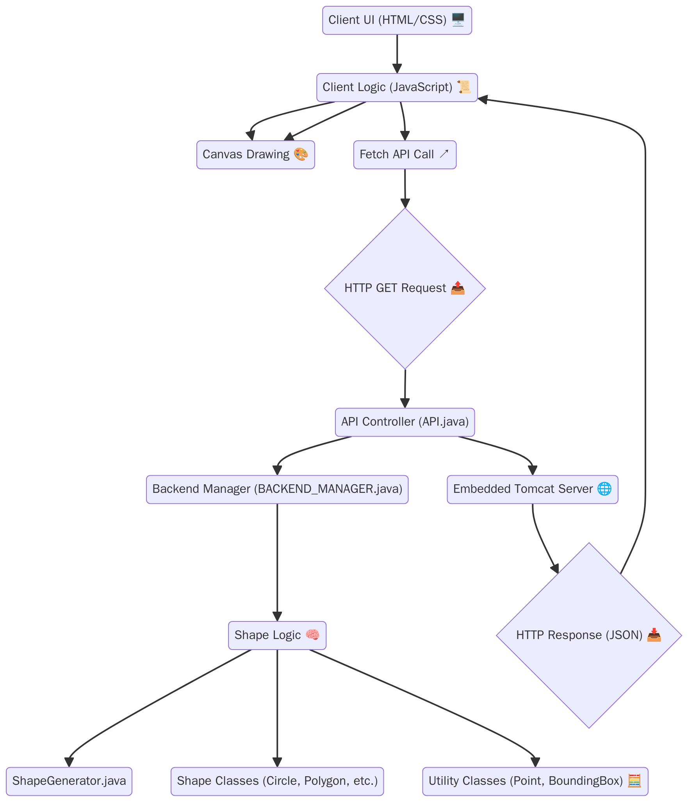
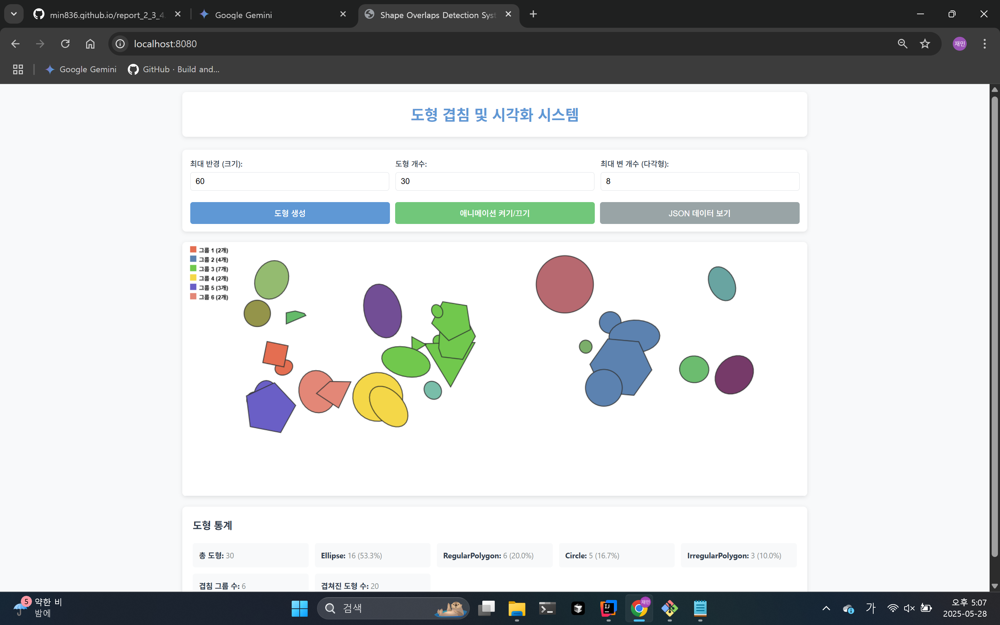
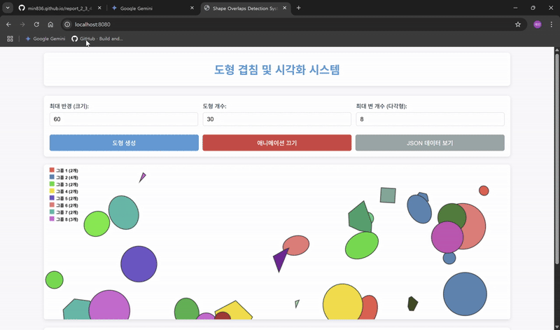
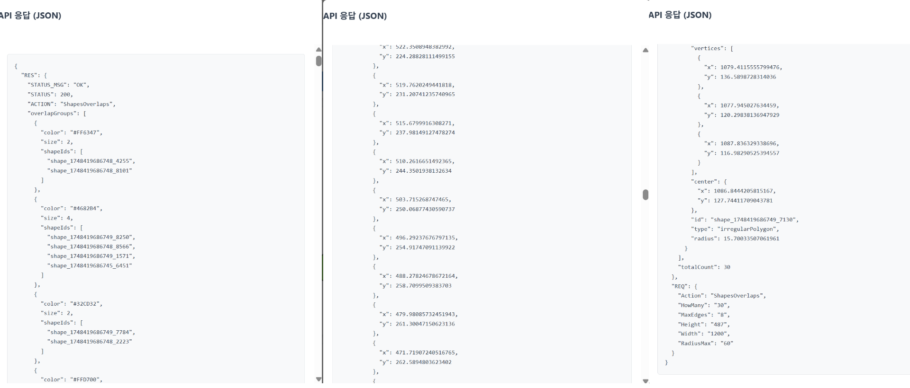

## 1. 프로젝트 개요


### 1.1. 프로젝트 목적 및 기능

본 프로젝트는 사용자가 정의한 조건에 따라 다양한 2차원 도형(원, 정다각형, 비정형 다각형, 타원)을 웹 인터페이스 상에 무작위로 생성하고, 이들 간의 **겹침(Overlap) 여부를 실시간으로 감지하여 시각화**하는 시스템 개발을 목적으로 합니다. 겹치는 도형들은 그룹으로 묶어 동일한 색상으로 표시함으로써 사용자가 직관적으로 겹침 상태를 파악할 수 있도록 합니다. 사용자는 도형의 최대 크기, 개수, 다각형의 최대 변 수 등을 조절할 수 있으며, 생성된 도형 정보 및 겹침 그룹 통계를 확인할 수 있습니다. 또한, 추가 기능으로 도형들의 간단한 애니메이션 효과와 모바일 반응형 디자인을 적용하여 사용자 경험을 향상시켰습니다.

**주요 기능:**
* 다양한 2D 도형(원, 정다각형, 비정형 다각형, 타원) 생성
* 도형 간 겹침 감지 및 시각화
* 겹침 도형 그룹화 및 색상 구분
* 사용자 정의 파라미터를 통한 도형 생성 제어
* 통계 정보(도형 수, 타입별 비율, 겹침 그룹 수 등) 제공
* 간단한 애니메이션 효과 및 모바일 반응형 UI


### 1.2. 사용된 기술 스택

* **백엔드 (Backend):**
    * Java 21
    * Spring Boot 3.x (build.gradle상 버전 3.4.5)
    * Spring Web MVC
    * org.json (JSON 데이터 처리)
    * Gradle (빌드 도구)
* **프론트엔드 (Frontend):**
    * HTML5
    * CSS3
    * JavaScript (ES6+)
* **개발 환경:**
    * IntelliJ IDEA
    * JDK 21


### 1.3. 시스템 아키텍처 다이어그램



---

## 2. 기술 분석


### 2.1. Spring Boot 구조 및 설계 설명

본 프로젝트는 **Spring Boot** 프레임워크를 기반으로 개발되었습니다. Spring Boot는 다음과 같은 특징을 활용하여 웹 애플리케이션 개발을 용이하게 합니다:

* **내장 웹 서버:** `spring-boot-starter-tomcat` 의존성을 통해 Tomcat 서버가 내장되어 있어, 별도의 외부 웹 서버 설정 없이 애플리케이션을 독립적으로 실행할 수 있습니다.
* **자동 구성 (Auto-configuration):** `spring-boot-starter-web`과 같은 "스타터(starter)" 의존성은 일반적인 애플리케이션 기능을 위한 설정을 자동으로 구성해줍니다. 이를 통해 개발자는 세부 설정보다는 비즈니스 로직 개발에 더 집중할 수 있습니다.
* **REST 컨트롤러 (`API.java`):** `@RestController` 어노테이션을 사용하여 클라이언트의 HTTP 요청을 처리하는 REST API 엔드포인트를 정의합니다. `@RequestMapping` 어노테이션은 특정 URL 경로 및 HTTP 메소드와 컨트롤러 메소드를 매핑합니다.
* **컴포넌트 스캔 (`@Component`):** `BACKEND_MANAGER.java` 클래스에 `@Component` 어노테이션을 사용하여 해당 클래스의 인스턴스를 Spring 컨테이너가 관리하는 빈(Bean)으로 등록합니다.
* **정적 리소스 제공:** `application.properties` 파일의 `spring.web.resources.static-locations=classpath:/static/` 설정을 통해 `src/main/resources/static` 폴더에 위치한 `index.html`, `script.js` 등의 정적 파일들을 웹 서버가 직접 제공합니다.

프로젝트는 `knu.jjm` 패키지를 중심으로 구성되며, `API.java`가 웹 요청을 받고, `BACKEND_MANAGER.java`가 요청을 분석하여 실제 로직을 수행하는 `shapes` 패키지 내의 클래스들(예: `ShapeGenerator.java`)을 호출하는 구조를 가집니다.


### 2.2. REST API 설계 원칙 설명

본 프로젝트의 백엔드는 클라이언트(프론트엔드 JavaScript)와 JSON 형식으로 데이터를 주고받기 위해 REST API를 사용합니다. 주요 설계 원칙은 다음과 같습니다.

* **단일 엔드포인트 및 액션 파라미터:** `/api`라는 단일 엔드포인트를 통해 모든 요청을 받으며, 실제 수행할 작업은 `Action`이라는 요청 파라미터로 구분합니다.
* **HTTP 메소드:** `API.java`는 GET과 POST 요청을 모두 동일한 방식으로 처리하도록 `@RequestMapping`에 설정되어 있습니다. 요청 파라미터는 URL 쿼리 스트링으로 전달됩니다.
* **JSON 데이터 형식:** 서버는 응답 데이터를 JSON 형식으로 반환합니다. `API.java`에서 `response.setContentType("application/json;charset=UTF-8")`을 설정하고, `org.json.JSONObject`를 사용하여 JSON 응답을 구성합니다.
* **상태 코드 및 응답 구조:** 성공 시 HTTP 200 (OK) 상태 코드를 반환하며, 요청 오류(예: `Action` 파라미터 누락) 시 400 (Bad Request), 서버 내부 오류 시 500 (Internal Server Error) 상태 코드를 응답에 설정합니다. 또한, JSON 응답 내 `RES` 객체에 `STATUS`와 `STATUS_MSG` 필드를 포함하여 클라이언트가 처리 상태를 상세히 알 수 있도록 합니다.


### 2.3. 객체지향 설계 적용 사례 분석 (상속, 다형성, 캡슐화)

본 프로젝트는 객체지향 설계 원칙을 적극적으로 활용하여 코드의 재사용성, 유연성, 유지보수성을 높였습니다.

* **상속 (Inheritance):**
    * `Shape`라는 추상 클래스를 정의하여 모든 도형(Circle, RegularPolygon, IrregularPolygon, Ellipse)이 공유하는 공통 속성(id, center, color, radius 등)과 행위(toJSON, getShapeType, getVertices, getBoundingBox, overlaps의 추상적 정의)를 제공합니다.
    * 각각의 구체적인 도형 클래스들은 `Shape` 클래스를 상속받아 자신만의 고유한 특징을 구현하고, 공통 인터페이스를 따릅니다.
* **다형성 (Polymorphism):**
    * `ShapeGenerator.java`에서는 `List<Shape>` 타입의 컬렉션을 사용하여 다양한 종류의 도형 객체들을 일관된 방식으로 관리하고 처리합니다.
    * `shape.overlaps(otherShape)`와 같이 `Shape` 타입의 참조 변수를 통해 `overlaps` 메소드를 호출하면, 실제 객체의 타입(예: `Circle`, `RegularPolygon`)에 따라 오버라이드된 해당 클래스의 `overlaps` 메소드가 동적으로 호출됩니다. 이는 `toJSON`, `getVertices` 등의 다른 메소드에도 동일하게 적용됩니다.
* **캡슐화 (Encapsulation):**
    * 각 도형 클래스는 자신의 내부 상태(예: `Circle`의 `radius`, `RegularPolygon`의 `sides`와 `vertices`)를 `protected` 또는 `private` 접근 제어자로 보호하고, `public` 메소드(getter, setter 또는 특정 기능을 수행하는 메소드)를 통해 외부와 상호작용합니다. 예를 들어, `Point` 클래스의 `x`, `y` 좌표는 `private`으로 선언되고 `getX()`, `getY()` 메소드를 통해 접근합니다. 이는 객체의 내부 구현을 외부로부터 숨기고 데이터의 일관성을 유지하는 데 도움을 줍니다.

---

## 3. 알고리즘 상세 설명


### 3.1. 구현한 겹침 감지 알고리즘의 원리 설명

본 프로젝트에서 도형 간 겹침 감지는 두 단계로 수행됩니다:

1.  **광역 단계 (Broad Phase):** 먼저 각 도형의 축에 정렬된 경계 상자(AABB: Axis-Aligned Bounding Box)들이 겹치는지 빠르게 검사합니다. `BoundingBox.java` 클래스의 `overlaps` 메소드가 이 역할을 수행하며, 두 경계 상자의 x축과 y축 범위가 각각 겹치는지 확인합니다. 경계 상자가 겹치지 않으면, 실제 도형도 겹치지 않으므로 더 비싼 상세 검사를 생략하여 성능을 향상시킵니다. 이 로직은 `ShapeGenerator.java`의 `findConnectedComponents` 메소드 내에서 `shape1.getBoundingBox().overlaps(shape2.getBoundingBox())` 조건으로 구현되어 있습니다.
2.  **협역 단계 (Narrow Phase):** 경계 상자가 겹치는 도형 쌍에 대해서만 실제 기하학적 형태를 고려한 상세 겹침 검사를 수행합니다. 이는 각 도형 클래스(`Circle`, `RegularPolygon` 등)의 `overlaps(Shape other)` 메소드에서 구체적으로 구현됩니다.
    * **원-원 겹침:** 두 원의 중심점 사이의 거리가 각 원의 반지름 합보다 작은지 비교하여 판단합니다.
    * **다각형-다각형 겹침 (타원 포함):** 분리축 이론(SAT)을 사용합니다 (3.2절 참고). 타원의 경우, 여러 개의 정점으로 근사된 다각형으로 간주하여 SAT를 적용합니다.
    * **원-다각형 겹침:** `Circle.java`에서는 다각형의 각 정점이 원 내부에 있는지, 원의 중심이 다각형 내부에 있는지 (Point-in-Polygon 테스트), 그리고 다각형의 각 변과 원이 교차하는지를 검사하는 복합적인 로직을 사용합니다.


### 3.2. SAT 알고리즘의 동작 원리

분리축 이론(Separating Axis Theorem, SAT)은 두 개의 볼록(convex) 다각형이 서로 겹치는지 여부를 판단하는 데 사용되는 알고리즘입니다.

* **핵심 아이디어:** 두 볼록 다각형이 겹치지 않는다면, 그들 사이에 항상 "분리축"이라고 하는 선(2D) 또는 평면(3D)이 존재합니다. 이 분리축에 두 다각형을 투영(project)했을 때, 투영된 두 선분(또는 구간)이 서로 겹치지 않으면 해당 축은 분리축이 됩니다. 만약 단 하나의 분리축이라도 찾을 수 있다면 두 다각형은 겹치지 않는 것입니다. 반대로, 검사해야 할 모든 잠재적인 분리축에 대해 두 다각형의 투영이 항상 겹친다면, 두 다각형은 서로 겹치는 것입니다.
* **검사할 축:** 볼록 다각형의 경우, 잠재적인 분리축은 각 다각형의 모든 변에 수직인 축들로 한정됩니다.
* **구현 과정 (`Shape.java` 및 다각형 클래스들):**
    1.  **축 생성:** 두 다각형 각각의 모든 변에 대해 수직인 법선 벡터(normal vector)를 계산하여 가능한 분리축들을 만듭니다. 이는 `Shape` 클래스의 `getAxes(List<Point> vertices)` 메소드에서 처리되며, 각 변의 벡터를 구해 90도 회전시키고 정규화(normalize)합니다.
    2.  **투영:** 생성된 각 축에 대해, 두 다각형의 모든 꼭짓점을 해당 축에 투영합니다. 각 다각형의 투영 결과는 해당 축 위의 선분(최솟값과 최댓값)으로 나타납니다. 이는 `Shape` 클래스의 `projectPolygon(List<Point> vertices, Point axis)` 메소드에서 각 꼭짓점과 축 벡터의 내적(dot product)을 계산하여 수행됩니다.
    3.  **겹침 확인:** 각 축에서 두 다각형의 투영된 선분들이 서로 겹치는지 확인합니다 (`Shape` 클래스의 `isProjectionOverlap(double[] proj1, double[] proj2)` 메소드). 만약 어느 한 축이라도 투영된 선분들이 겹치지 않으면, 그 축이 분리축이 되므로 두 다각형은 겹치지 않는다고 판단하고 즉시 `false`를 반환합니다.
    4.  **최종 판단:** 모든 검사 대상 축에서 투영된 선분들이 겹친다면, 분리축이 존재하지 않는 것이므로 두 다각형은 겹친다고 판단하고 `true`를 반환합니다.


### 3.3. 컨벡스 헐 알고리즘 설명

`IrregularPolygon.java`에서 비정형 다각형을 생성할 때, 무작위로 생성된 점들이 자기 교차하지 않는 단순 다각형 형태를 가지도록 하기 위해 컨벡스 헐(Convex Hull) 알고리즘의 일종인 모노톤 체인(Monotone Chain) 알고리즘을 사용합니다. 이는 `createSimpleConvexHull(List<Point> points)` 메소드에 구현되어 있습니다.

* **컨벡스 헐이란?** 주어진 점들의 집합을 모두 포함하는 가장 작은 볼록 다각형입니다.
* **모노톤 체인 알고리즘 동작 단계:**
    1.  **점 정렬:** 모든 점을 x좌표 기준으로 오름차순 정렬합니다. x좌표가 같을 경우 y좌표 기준으로 오름차순 정렬합니다.
    2.  **하부 껍질(Lower Hull) 생성:** 정렬된 점들을 순서대로 순회하면서 하부 껍질을 구성합니다. 새로운 점을 껍질에 추가할 때, 껍질에 이미 있는 마지막 두 점과 새로 추가할 점이 이루는 방향이 항상 "왼쪽으로 꺾이거나 일직선"을 유지하도록 합니다 (즉, 우회전하지 않도록). 만약 오른쪽으로 꺾이는(오목한) 부분이 생기면, 껍질의 마지막 점을 제거하고 다시 검사합니다. 점의 방향성은 `orientation(Point p, Point q, Point r)` 메소드를 통해 세 점의 외적(cross product) 부호를 이용하여 판단합니다.
    3.  **상부 껍질(Upper Hull) 생성:** 정렬된 점들을 반대 순서(x좌표가 큰 순)로 순회하면서 동일한 방식으로 상부 껍질을 구성합니다.
    4.  **결합 및 중복 제거:** 생성된 하부 껍질과 상부 껍질을 결합합니다. 이때, 시작점과 끝점이 중복될 수 있으므로 이를 제거하여 최종적인 컨벡스 헐을 완성합니다.


### 3.4. 연쇄적 그룹화 문제 해결 방안 (Union-Find 알고리즘)

여러 도형이 연쇄적으로 겹쳐 있을 때 (예: A-B 겹침, B-C 겹침 시 A, B, C는 한 그룹), 이들을 하나의 그룹으로 묶기 위해 Union-Find (또는 Disjoint Set Union, DSU) 알고리즘을 사용합니다. 이 로직은 `ShapeGenerator.java`의 `findConnectedComponents` 메소드에 구현되어 있습니다.

* **자료 구조:** 각 도형(원소)의 부모를 저장하는 `parent` 맵(Map)과 트리의 깊이를 근사하는 `rank` 맵을 사용합니다.
* **초기화:** 모든 도형은 초기에 자기 자신만을 포함하는 개별적인 집합(그룹)으로 시작합니다. 즉, 각 도형의 ID를 키로 하여 `parent` 맵에 자기 자신을 부모로 설정하고, `rank`는 0으로 초기화합니다.
* **Find 연산:** 특정 도형이 속한 집합의 대표(루트)를 찾는 연산입니다. 재귀적으로 부모를 따라가며, "경로 압축(Path Compression)" 최적화를 적용하여 트리의 높이를 줄여 다음 Find 연산의 효율을 높입니다.
* **Union 연산:** 두 도형이 겹친다고 판단되면, 각 도형이 속한 두 집합을 하나로 합칩니다. 두 집합의 루트를 찾은 후, "랭크에 의한 합치기(Union by Rank)" 최적화를 사용하여 `rank`가 낮은 트리를 `rank`가 높은 트리의 루트에 연결합니다. 두 랭크가 같다면 하나를 다른 쪽에 연결하고 랭크를 증가시킵니다. 이는 트리가 비효율적으로 길어지는 것을 방지합니다.
* **그룹화:** 모든 겹치는 도형 쌍에 대해 Union 연산을 수행한 후, 각 도형에 대해 Find 연산을 수행하여 해당 도형이 속한 그룹의 최종 대표를 찾습니다. 동일한 대표를 가진 도형들은 같은 겹침 그룹에 속하게 됩니다.

---

## 4. 구현 세부사항


### 4.1. 주요 클래스 및 메서드 설명

* **`Shape` (추상 클래스):**
    * 모든 도형의 기반이 되는 추상 클래스입니다.
    * **주요 속성:** `id`, `center` (도형 중심점, `Point` 타입), `color` (도형 색상 문자열), `radius` (도형의 대표 크기를 나타내는 값).
    * **주요 추상 메소드:**
        * `overlaps(Shape other)`: 다른 `Shape` 객체와의 겹침 여부를 판단합니다. 각 하위 도형 클래스에서 구체적인 로직을 구현합니다.
        * `toJSON()`: 도형의 정보를 `JSONObject`로 변환하여 반환합니다.
        * `getShapeType()`: 도형의 종류를 나타내는 문자열(예: "circle", "ellipse")을 반환합니다.
        * `getVertices()`: 도형을 구성하는 정점들의 리스트(`List<Point>`)를 반환합니다. 원이나 타원의 경우 근사된 정점들을 반환합니다.
        * `getBoundingBox()`: 도형의 축에 정렬된 경계 상자(`BoundingBox`)를 반환합니다.
    * **공통 유틸리티 메소드 (SAT 알고리즘 지원):**
        * `getAxes(List<Point> vertices)`: 다각형의 정점들로부터 분리축이 될 수 있는 축 벡터들을 계산합니다.
        * `projectPolygon(List<Point> vertices, Point axis)`: 주어진 축에 다각형을 투영하여 최소/최대값을 계산합니다.
        * `isProjectionOverlap(double[] proj1, double[] proj2)`: 두 투영 구간이 겹치는지 확인합니다.

* **구체적인 도형 클래스들:**
    * **`Circle.java`:** `Shape`를 상속받아 원을 표현합니다. `radius`를 실제 반지름으로 사용하며, 원-원, 원-다각형 겹침 로직을 구현합니다.
    * **`RegularPolygon.java`:** `Shape`를 상속받아 정다각형을 표현합니다. `sides` (변의 개수), `rotationAngle` (회전각)을 속성으로 가지며, SAT를 이용해 겹침을 판단합니다.
    * **`IrregularPolygon.java`:** `Shape`를 상속받아 비정형 다각형을 표현합니다. 생성 시 무작위 정점들로 컨벡스 헐을 만들어 단순 다각형을 보장하며, SAT로 겹침을 판단합니다.
    * **`Ellipse.java`:** `Shape`를 상속받아 타원을 표현합니다. `radiusX`, `radiusY`, `rotationAngle`을 속성으로 가지며, 근사된 정점들을 이용해 SAT로 겹침을 판단합니다.

* **`Point.java`:**
    * 2차원 공간의 점(x, y 좌표)을 나타내는 클래스입니다.
    * 두 점 사이의 거리 계산(`distanceTo`), JSON 변환(`toJSON`), 기본적인 벡터 연산(덧셈 `add`, 뺄셈 `subtract`, 내적 `dotProduct`, 정규화 `normalize`) 등을 지원합니다.

* **`BoundingBox.java`:**
    * 축에 정렬된 경계 상자(Axis-Aligned Bounding Box, AABB)를 나타냅니다. `minX`, `minY`, `maxX`, `maxY` 좌표를 가집니다.
    * `overlaps(BoundingBox other)`: 다른 경계 상자와의 겹침 여부를 빠르게 판단합니다.

* **`ShapeGenerator.java`:**
    * **`generateShapes(...)`**: 핵심 메소드로, 요청된 조건(캔버스 크기, 도형 최대 크기, 개수, 최대 변 수)에 따라 다양한 종류의 도형 객체들을 무작위로 생성하여 `List<Shape>` 형태로 반환 준비를 합니다. 또한, 겹침 그룹을 찾고 그룹별 색상을 할당한 후, 최종적으로 모든 도형 정보와 겹침 그룹 정보를 담은 `JSONObject`를 생성하여 반환합니다.
    * **`findConnectedComponents(List<Shape> shapes)`**: 도형 리스트를 입력받아, 먼저 각 도형 쌍의 경계 상자 겹침을 확인합니다. 경계 상자가 겹치는 경우에만 상세 `overlaps` 메소드를 호출하여 실제 겹침을 판단하고, Union-Find 알고리즘을 사용하여 서로 연결된(겹치는) 도형들의 그룹을 찾습니다.
    * **`assignGroupColors(List<Shape> shapes, List<Set<String>> groups)`**: 식별된 겹침 그룹(2개 이상의 도형으로 구성된 그룹)에 대해 고유한 색상을 할당합니다. 겹치지 않거나 단일 도형으로만 구성된 그룹은 원래의 무작위 색상을 유지합니다.
    * **`convertGroupsToJSON(...)`**: 겹침 그룹 정보를 프론트엔드로 전달하기 적합한 `JSONArray` 형태로 변환합니다.

* **`API.java` (Spring Boot 컨트롤러):**
    * `@RestController` 어노테이션으로 지정되어 HTTP 요청을 처리하는 API 엔드포인트 역할을 합니다.
    * **`requestParams(HttpServletRequest request, HttpServletResponse response)`**: `/api` 경로로 들어오는 GET 또는 POST 요청을 처리합니다. 요청 파라미터를 추출하여 `JSONObject` (params_JSON)로 만들고, 응답을 위한 `JSONObject` (JSON_RES_STATUS)를 준비합니다. `BACKEND_MANAGER.EXEC_TASK` 메소드를 호출하여 실제 로직 처리를 위임하고, 최종 결과를 포함하는 래퍼 `JSONObject` (JSON_RESPONSE_WRAPPER)를 문자열로 변환하여 클라이언트에 반환합니다. 예외 발생 시 적절한 HTTP 상태 코드와 오류 정보를 JSON 응답에 포함시킵니다.

* **`BACKEND_MANAGER.java`:**
    * **`EXEC_TASK(JSONObject reqJson, JSONObject resJson)`**: `API.java`로부터 요청 데이터(`reqJson`)와 응답을 채울 객체(`resJson`)를 전달받습니다. `reqJson`에 포함된 `Action` 파라미터 값에 따라 `switch` 문으로 분기하여 해당 작업을 수행합니다.
        * `"ShapesOverlaps"` 액션의 경우: `ShapeGenerator` 객체를 생성하고 `generateShapes` 메소드를 호출하여 도형 및 겹침 그룹 데이터를 얻은 후, 이 데이터를 전달받은 `resJson` 객체에 직접 채워 넣습니다.
        * 다른 기본 액션들(`echo`, `getCurrentTime` 등)도 유사하게 `resJson` 객체에 결과 데이터를 추가합니다.

* **`ShapeVisualizer.js` (프론트엔드 JavaScript 클래스):**
    * **`constructor()`**: 캔버스, DOM 요소 참조, 이벤트 리스너 설정 등 초기화 작업을 수행합니다. 페이지 로드 시 `generateShapes()`를 호출하여 초기 도형을 그립니다.
    * **`generateShapes()`**: 사용자 입력 컨트롤에서 값을 읽어와 API 요청 파라미터를 구성하고, `fetch` API를 사용하여 백엔드에 도형 데이터를 비동기적으로 요청합니다. 응답을 받으면 `currentShapesData`를 업데이트하고, `prepareShapesForAnimation()`, `drawFrame()`, `updateStats()` 등을 호출합니다. 로딩 중임을 시각적으로 표시하는 `showLoading()`도 관리합니다.
    * **`prepareShapesForAnimation(shapes)`**: 서버로부터 받은 도형 데이터에 애니메이션을 위한 추가 속성(초기 위치, 속도, 투명도 등)을 부여하여 `shapesForAnimation` 배열을 준비합니다.
    * **`drawFrame()`**: 캔버스를 깨끗이 지우고 `shapesForAnimation` 배열에 있는 모든 도형을 그립니다. 겹침 그룹 정보도 함께 표시합니다.
    * **`drawShape(shapeData)`**: 개별 도형 데이터를 받아 해당 타입(원, 다각형, 타원)에 맞춰 캔버스에 그립니다. 애니메이션이 활성화된 경우 애니메이션 상태(위치, 투명도)를 반영하여 그립니다.
    * **`updateAnimationState()`**: 애니메이션이 활성화된 경우 각 도형의 다음 프레임 상태(위치 이동, 투명도 변화 등)를 계산합니다. 간단한 경계 충돌(튕김 효과)도 포함합니다.
    * **`animationLoop()`**: `requestAnimationFrame`을 사용하여 애니메이션 루프를 구성합니다. `updateAnimationState()`로 상태를 업데이트하고 `drawFrame()`으로 다시 그립니다.
    * **`toggleAnimation()`**: 애니메이션 활성화 상태를 토글하고, 버튼 텍스트와 스타일을 변경하며, 애니메이션 루프를 시작하거나 중지합니다.
    * **`updateStats(shapesData)`**: 서버로부터 받은 데이터를 기반으로 총 도형 수, 타입별 개수 및 비율, 겹침 그룹 수, 겹쳐진 도형 수 등의 통계 정보를 계산하여 HTML 요소에 업데이트합니다.
    * **`updateCanvasSize()`**: 브라우저 창 크기가 변경될 때 캔버스의 실제 너비와 높이를 동적으로 조절하고, 필요시 도형을 다시 그립니다.
    * **`showJsonModal()`, `closeJsonModal()`**: 원시 JSON 데이터를 보여주는 모달 창을 제어합니다.


## 4.2. JSON 데이터 구조 설계

서버(백엔드)와 클라이언트(프론트엔드) 간의 데이터 교환은 JSON 형식을 사용합니다. `API.java`에서 클라이언트로 반환되는 최종 응답 JSON의 전체적인 구조는 다음과 같습니다:

```json
{
  "REQ": {
    // 클라이언트가 보낸 원본 요청 파라미터들이 여기에 포함됩니다.
    // 예: "Action": "ShapesOverlaps", "Width": "800", "Height": "600", ...
  },
  "RES": {
    // 서버의 처리 결과가 여기에 포함됩니다.
    "STATUS": 200, // HTTP 상태 코드와 유사한 응답의 성공/실패 여부
    "STATUS_MSG": "OK", // 상태에 대한 간단한 메시지
    "ACTION": "ShapesOverlaps", // 처리된 요청 Action
    "shapes": [ // 생성된 도형 객체들의 배열
      {
        "type": "circle", // 도형의 종류 (예: "circle", "regularPolygon", "irregularPolygon", "ellipse")
        "id": "shape_1716880000000_1234", // 각 도형의 고유 ID
        "center": {"x": 123.45, "y": 678.90}, // 도형 중심의 x, y 좌표
        "radius": 50.0, // 원의 경우 실제 반지름, 다른 도형은 대표 크기 또는 외접원 반지름 등
        "color": "#RRGGBB", // 도형의 색상 코드 (HEX)
        // --- 도형 타입별 추가 속성 ---
        // RegularPolygon: "sides", "rotationAngle", "vertices" (JSON 배열)
        // IrregularPolygon: "vertices" (JSON 배열)
        // Ellipse: "radiusX", "radiusY", "rotationAngle", "verticesForDrawing" (JSON 배열)
        // Circle: (위 기본 속성 외 특별한 추가 속성 없음, getVertices()는 근사 정점 반환)
      }
      // ... 다른 도형 객체들이 배열 요소로 추가 ...
    ],
    "totalCount": 10, // 생성된 총 도형의 개수
    "overlapGroups": [ // 겹침 그룹 정보 배열 (2개 이상 겹치는 그룹만 해당)
      {
        "shapeIds": ["shape_id_1", "shape_id_2", "..."], // 해당 그룹에 속한 도형들의 ID 배열
        "color": "#AABBCC", // 그룹에 할당된 공통 색상 코드
        "size": 3 // 그룹에 속한 도형의 개수
      }
      // ... 다른 겹침 그룹 정보 객체들이 배열 요소로 추가 ...
    ]
    // 만약 서버 처리 중 오류 발생 시, "ERROR_MESSAGE", "StackTrace" 등의 필드가 추가될 수 있음
  }
}
각 도형 객체의 JSON 표현은 해당 Java 클래스(`Circle.java`, `Ellipse.java` 등)의 `toJSON()` 메소드에서 생성됩니다. `ShapeGenerator.java`는 개별 도형 JSON 객체들을 `shapes` 배열에 담고, 겹침 그룹 정보를 `overlapGroups` 배열로 만들어 최종 `JSONObject`를 구성합니다.


## 4.3. 프론트엔드-백엔드 통신 방식

### 요청 (Request):

* 클라이언트(웹 브라우저의 `script.js`)는 HTML 페이지의 사용자 입력(최대 반경, 도형 개수 등)을 바탕으로 요청 파라미터를 구성합니다.
* JavaScript의 `fetch` API를 사용하여 백엔드 서버의 `/api` 엔드포인트로 비동기 HTTP GET 요청을 전송합니다.
* 요청 파라미터들(예: `Action=ShapesOverlaps`, `Width=800`, `Height=600` 등)은 `URLSearchParams` 객체를 통해 URL의 쿼리 문자열(query string) 형태로 인코딩되어 URL에 포함됩니다.

### 응답 (Response):

* 서버(`API.java`)는 이 요청을 받아 처리한 후, 위 4.2절에서 설명한 구조의 JSON 데이터를 HTTP 응답 본문에 담아 클라이언트로 반환합니다. 응답의 `Content-Type`은 `application/json;charset=UTF-8`로 설정됩니다.

### 응답 처리:

* 클라이언트(`script.js`)는 `fetch`의 `response.json()` 메소드를 호출하여 응답 본문을 JavaScript 객체로 파싱합니다.
* 파싱된 데이터를 사용하여 `ShapeVisualizer` 클래스의 해당 메소드들(`prepareShapesForAnimation`, `drawFrame`, `updateStats`)을 호출하여 화면을 업데이트합니다.


## 4.4. 에러 처리 전략

### 클라이언트 측 에러 처리 (`script.js`):

* `generateShapes` 메소드 내 `fetch` 호출 부분에서 `response.ok` 속성을 확인하여 HTTP 상태 코드가 성공 범위(200-299)를 벗어나는 경우 에러로 간주하고 `Error` 객체를 발생시킵니다.
* `try...catch` 블록을 사용하여 네트워크 통신 중 발생할 수 있는 예외 (예: 서버 연결 불가)나 JSON 파싱 과정에서의 예외를 모두 포착합니다.
* 오류가 감지되면, `displayError()` 메소드가 호출되어 사용자에게 캔버스 영역에 "서버 통신 오류: [오류 메시지]" 또는 "도형 데이터 로드 실패: [서버 메시지]" 형태로 알림을 표시합니다. 동시에 브라우저 개발자 콘솔에는 더 자세한 오류 정보(`console.error`)를 출력하여 디버깅을 돕습니다.

### 서버 측 에러 처리 (`API.java` 및 `BACKEND_MANAGER.java`):

* **`API.java`**:
    * `requestParams` 메소드에서 `BACKEND_MANAGER.EXEC_TASK` 호출을 포함한 핵심 로직 부분을 `try...catch (Exception e)` 블록으로 감싸, 발생할 수 있는 모든 종류의 예외를 포괄적으로 처리합니다.
    * 예외 발생 시, 클라이언트로 반환될 JSON 응답(`JSON_RES_STATUS` 객체)에 **STATUS**를 `500` (Internal Server Error)으로, **STATUS_MSG**를 `"Internal Server Error"`로 설정합니다.
    * 추가적으로, 발생한 예외의 메시지(`e.getMessage()`)를 **ERROR_MESSAGE** 필드에, 전체 스택 트레이스(stack trace)를 **StackTrace** 필드(JSON 배열 형태)에 담아 응답에 포함시킵니다. (실제 운영 환경에서는 보안상의 이유로 클라이언트에 스택 트레이스 전체를 노출하지 않는 것이 좋습니다.)
    * HTTP 응답 상태 코드도 `response.setStatus(HttpServletResponse.SC_INTERNAL_SERVER_ERROR)`를 통해 `500`으로 설정합니다.
* **`BACKEND_MANAGER.java`**:
    * 메소드 내에서 잘못된 요청 파라미터(예: 필수 파라미터 누락, 숫자 형식 오류, 유효하지 않은 값 범위)가 감지되면 `IllegalArgumentException`을 발생시킵니다.
    * 지원하지 않는 `Action`이 요청되면 `UnsupportedOperationException`을 발생시킵니다.
    * 이러한 예외들은 `API.java`의 `catch` 블록에서 일관되게 처리되어 클라이언트에게 적절한 오류 응답이 전달되도록 합니다.

---

## 5. 실행 결과 및 검증

본 섹션에서는 개발된 "Shape Overlaps Detection System"의 주요 기능들이 정상적으로 동작하는지 다양한 테스트 케이스를 통해 검증하고, 그 실행 결과를 스크린샷과 함께 제시합니다. 또한, 성능 최적화를 위해 고려된 사항들을 간략히 언급합니다.


### 5.1. 다양한 테스트 케이스 실행 결과

* **기본 도형 생성 및 시각화:**
    * **테스트 조건:** 웹 페이지 로드 시 또는 "도형 생성" 버튼 클릭 시 기본 설정값(예: 최대 반경 60, 도형 개수 30, 최대 변 개수 8)으로 도형 생성.
    * **예상 결과:** 다양한 종류의 도형(원, 정다각형, 비정형 다각형, 타원)이 지정된 개수만큼 캔버스 내에 무작위 위치, 크기, 색상으로 정상적으로 생성되고 시각화되어야 합니다.
    * **실제 결과:** *(여기에 실제 테스트 후 결과를 서술합니다. 예: "기본값으로 30개의 다양한 도형이 성공적으로 생성되었으며, 각기 다른 색상과 형태로 캔버스에 표시됨을 확인하였다.")*

* **겹침 감지 및 그룹화 시각화:**
    * **테스트 조건 1 (단순 겹침):** 소수의 도형(예: 5개)을 생성하여 명확하게 2~3개의 도형이 서로 겹치도록 유도.
    * **예상 결과 1:** 겹치는 도형들은 같은 그룹으로 식별되어 동일한 색상으로 표시되고, 통계 정보에도 해당 그룹 정보가 반영되어야 합니다.
    * **실제 결과 1:** *(테스트 후 결과 서술)*
    * **테스트 조건 2 (연쇄적 겹침):** 다수의 도형(예: 30개 이상)을 생성하여 여러 도형이 복잡하게 연쇄적으로 겹치는 상황 발생 유도.
    * **예상 결과 2:** 연쇄적으로 겹친 모든 도형들이 하나의 그룹으로 올바르게 식별되고, 해당 그룹 색상으로 통일되어 표시되어야 합니다.
    * **실제 결과 2:** *(테스트 후 결과 서술)*

* **사용자 입력 파라미터 변경 테스트:**
    * **테스트 조건:** "최대 반경", "도형 개수", "최대 변 개수" 입력 필드의 값을 최소/최대 또는 특정 값으로 변경 후 "도형 생성" 버튼 클릭.
    * **예상 결과:** 변경된 파라미터 값에 따라 생성되는 도형의 크기, 개수, 다각형의 복잡도가 적절히 반영되어야 합니다. 예를 들어, "도형 개수"를 5로 줄이면 5개의 도형만 나타나야 합니다.
    * **실제 결과:** *(각 파라미터 변경에 따른 결과 서술)*

* **애니메이션 효과 테스트:**
    * **테스트 조건:** "애니메이션 켜기/끄기" 버튼을 클릭하여 애니메이션 상태를 토글.
    * **예상 결과:** 애니메이션이 켜지면 도형들이 부드럽게 등장하거나 움직이는 효과가 나타나고, 꺼지면 정적인 상태로 돌아와야 합니다. 버튼의 텍스트와 스타일도 상태에 맞게 변경되어야 합니다.
    * **실제 결과:** *(테스트 후 결과 서술)*

* **모바일 반응형 디자인 테스트:**
    * **테스트 조건:** 데스크톱 브라우저 창 크기를 다양하게 조절하거나, 브라우저 개발자 도구의 모바일 뷰 시뮬레이터를 사용하여 여러 기기(스마트폰, 태블릿 등) 화면 크기에서 확인.
    * **예상 결과:** UI 요소(헤더, 컨트롤, 버튼, 캔버스, 통계 영역)들이 화면 크기에 맞춰 적절히 재배치되거나 크기가 조절되어 가독성과 사용성을 유지해야 합니다. 캔버스 내의 도형들도 정상적으로 보여야 합니다. (CSS @media 쿼리 확인)
    * **실제 결과:** *(테스트 후 결과 서술)*

* **JSON 데이터 확인:**
    * **테스트 조건:** "JSON 데이터 보기" 버튼 클릭.
    * **예상 결과:** 백엔드로부터 수신한 원시 JSON 데이터가 모달 창에 정상적으로 표시되어야 하며, 데이터 구조는 "4.2. JSON 데이터 구조 설계"에서 설명한 형식과 일치해야 합니다.
    * **실제 결과:** *(테스트 후 결과 서술)*


### 5.2. 스크린샷과 함께 기능 시연

본 프로그램의 주요 기능들이 실제로 어떻게 동작하는지 아래의 시각 자료를 통해 확인할 수 있습니다.

**1. 주요 기능 시연 (도형 생성, 겹침 감지 및 그룹화, 통계 정보)**


*캡션: 프로그램 실행 시 기본 파라미터로 다양한 도형들이 생성된 모습입니다. 화면 중앙의 캔버스에는 생성된 도형들과 겹침에 따라 그룹화되어 동일한 색상으로 표시된 도형들을 확인할 수 있습니다. 상단에는 도형 생성 조건을 제어하는 컨트롤 패널이, 하단에는 생성된 도형에 대한 통계 정보(총 개수, 타입별 분포, 겹침 그룹 수 등)가 실시간으로 표시됩니다.*

**2. 애니메이션 효과 시연**


*캡션: "애니메이션 켜기" 버튼을 활성화했을 때 도형들이 부드럽게 등장하고 캔버스 내에서 움직이는 모습입니다. 애니메이션은 다시 버튼을 눌러 중지할 수 있습니다.*

*(만약 MP4 등 비디오 파일을 사용하신다면 아래와 같이 HTML 태그를 사용할 수 있습니다.)*

~~**3. 모바일 환경에서의 반응형 UI**~~

~~~~
~~*캡션: 스마트폰과 같은 작은 화면에서도 컨트롤 패널, 캔버스, 통계 정보 영역 등이 적절히 재배치되어 사용성을 유지하는 모습입니다. (브라우저 개발자 도구의 모바일 시뮬레이터 화면)*~~

**4. JSON 데이터 확인**


*캡션: "JSON 데이터 보기" 기능을 통해 백엔드로부터 수신한 원시 JSON 응답(생성된 도형들의 상세 정보, 겹침 그룹 정보 등)을 모달 창에서 직접 확인할 수 있습니다. 이는 API 응답 구조를 명확히 보여줍니다.*


### 5.3. 성능 최적화 고려사항

본 프로젝트에서는 다음과 같은 성능 최적화 방안을 고려하고 적용했습니다:

* **경계 상자(Bounding Box)를 이용한 광역 단계(Broad Phase) 필터링:**
    * 모든 도형 쌍에 대해 비용이 큰 상세 겹침 검사를 수행하기 전에, 각 도형의 축에 정렬된 경계 상자(AABB)가 겹치는지 먼저 빠르게 확인합니다.
    * 경계 상자가 겹치지 않는 도형 쌍은 실제 겹침 가능성이 없으므로 상세 검사 대상에서 제외하여 전체 연산량을 줄입니다.

* **Union-Find 알고리즘 최적화:**
    * 겹치는 도형들을 그룹화하는 과정에서 Union-Find 알고리즘을 사용하며, 이때 '경로 압축(Path Compression)'과 '랭크에 의한 합치기(Union by Rank)' 최적화 기법을 적용하여 알고리즘의 시간 복잡도를 거의 선형 시간(amortized O(α(n)), α는 매우 느리게 증가하는 아커만 함수의 역함수)에 가깝게 유지합니다.

* **프론트엔드 렌더링 및 이벤트 처리 최적화:**
    * 애니메이션 구현 시 `requestAnimationFrame`을 사용하여 브라우저의 렌더링 주기에 맞춰 부드러운 시각 효과를 제공하고 불필요한 리소스를 절약합니다.
    * 윈도우 크기 변경(`resize`) 이벤트에 따른 캔버스 재조정 로직은 디바운싱(debouncing) 기법을 적용하여, 이벤트가 연속적으로 빠르게 발생할 때 마지막 이벤트에 대해서만 실제 처리를 수행하도록 하여 과도한 연산을 방지합니다.
    * 로딩 중임을 나타내는 오버레이를 사용하여 사용자에게 시스템이 작업 중임을 알려 대기 시간을 인지할 수 있도록 합니다.

* **향후 추가 고려 가능한 최적화:**
    * **공간 분할 (Spatial Partitioning):** 도형의 개수가 매우 많아질 경우, 백엔드에서 Quadtree나 K-d tree와 같은 공간 분할 자료구조를 도입하여 겹침 가능성이 있는 도형 쌍을 더 효과적으로 필터링함으로써 $O(N^2)$의 쌍별 검사를 줄일 수 있습니다.
    * **Web Workers:** 프론트엔드에서 매우 복잡한 계산(예: 수백 개 도형의 실시간 물리 시뮬레이션)이 필요하다면 Web Worker를 사용하여 메인 스레드의 부담을 줄이고 UI 반응성을 유지할 수 있습니다.
    * **데이터 전송량 최적화:** 도형 정점 데이터 등 전송되는 JSON 데이터의 크기를 줄이기 위한 압축 또는 바이너리 포맷 사용을 고려할 수 있습니다 (현재는 텍스트 기반 JSON).